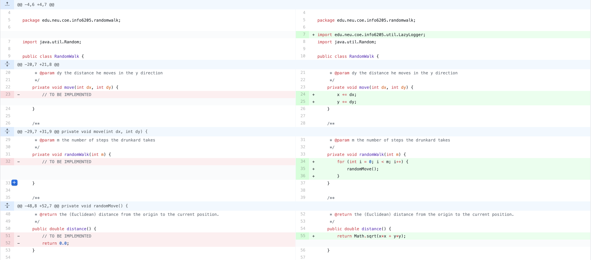
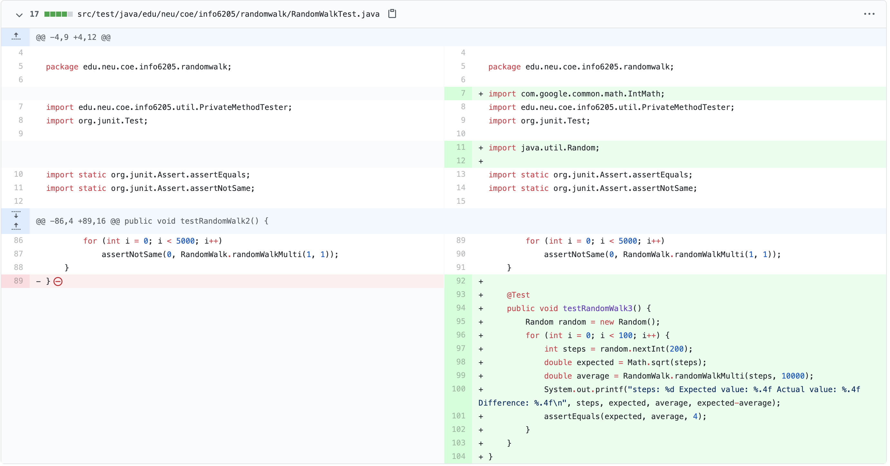
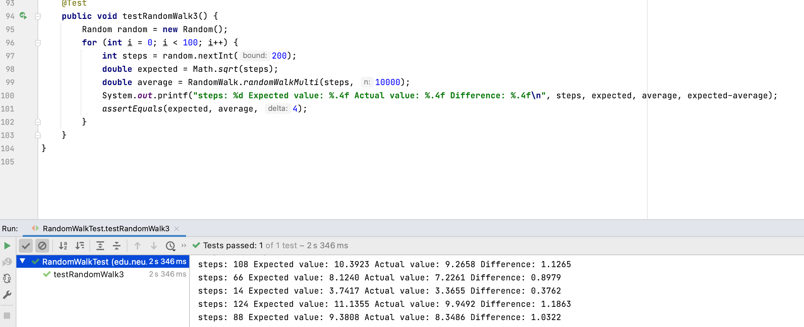

#### Author

[Kang Shentu](shentu.k@northeastern.edu)

001569432

#### Conclusion

>  **N is the number of steps and D is the man from the lamp post.**

Delta means the difference between the expected value and the actual value. The more tests, the more likely Delta will be to zero
$$
\sqrt n = d \pm \Delta
$$

#### Prove

According to the given topic, we can only get the expected value of the distance, that is, to find the following expected value
$$
E_n(X^2+Y^2)=\sum(x^2+y^2)P(X=x,Y=y)
$$

According to the same possibility of the four directions, it can be concluded that
$$
P(X=x+1,Y=y)=P(X=x+1,Y=y|X=x,Y=y)P(X=x,Y=y)=\frac{1}{4}P(X=x,Y=y)
$$

Therefore
$$
E_{n+1}(X^2+Y^2)=\frac{1}{4}\sum {[(x+1)^2+y^2]+[x^2+(y+1)^2]+[(x-1)^2+y^2]+[x^2+(y-1)^2]} P(X=x,Y=y)
$$

It can be obtained by simplification
$$
E_{n+1}(X^2+Y^2)=\sum (x^2+y^2+1)P(X=x,Y=y)=E_n(X^2+Y^2)+\sum P(X=x,Y=y)
$$
Absolutely
$$
\sum P(X=x,Y=y) = 1
$$
So, we can get
$$
E_{n}(X^2+Y^2)=n
$$

That is to say, the number of steps is the square of the expected Euclidean distance

#### Code Change

1. RandomWork.java

2. RandomWorkTest.java

#### Screen Shot

##### Given Test

##### My Test

